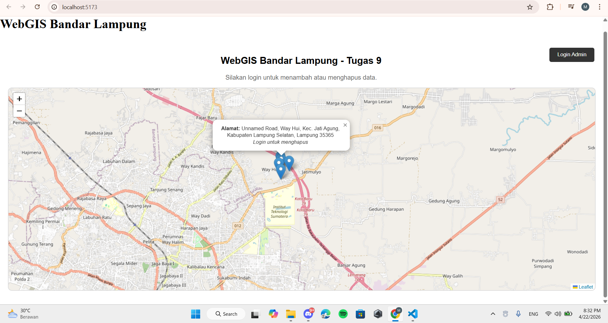
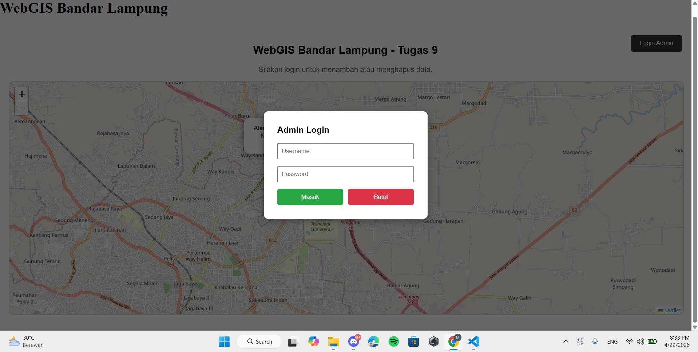
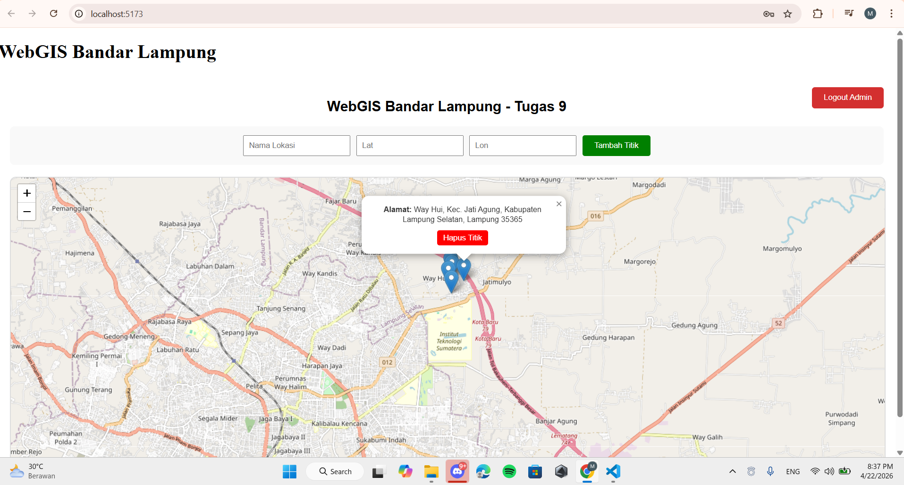
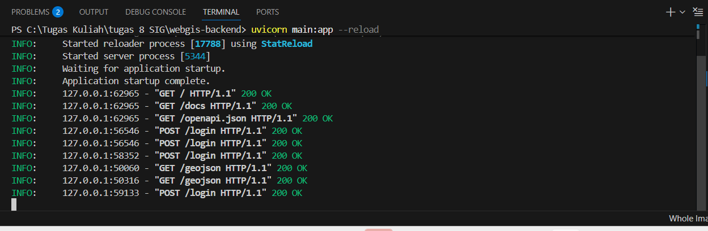

# WebGIS Fasilitas Publik Bandar Lampung - Tugas 9

Aplikasi WebGIS sederhana untuk pemetaan fasilitas publik di Kota Bandar Lampung. Aplikasi ini dibangun menggunakan stack FastAPI (Backend) dan React Leaflet (Frontend) dengan dukungan database spasial PostgreSQL/PostGIS.

## 🚀 Fitur Utama
* **Peta Interaktif**: Visualisasi data GeoJSON fasilitas publik.
* **CRUD Spasial**: Menambah dan menghapus titik lokasi langsung dari peta.
* **Autentikasi JWT**: Fitur admin (Tambah/Hapus) hanya terbuka setelah login.
* **Efek Spasial**: Hover highlight pada poligon/titik dan popup informasi.

---

## 🛠️ Setup & Instalasi

### 1. Prasyarat
* Python 3.x
* Node.js & npm
* PostgreSQL dengan ekstensi PostGIS

### 2. Konfigurasi Database
Jalankan query berikut di pgAdmin:
```sql
CREATE EXTENSION postgis;

CREATE TABLE fasilitas_publik (
    id SERIAL PRIMARY KEY,
    nama VARCHAR(100),
    alamat TEXT,
    jenis VARCHAR(50),
    geom GEOMETRY(Point, 4326)
);
```

### 3. Setup Backend (FastAPI)
* cd webgis-backend
* pip install -r requirements.txt
* uvicorn main:app --reload

### 4. Setup Frontend (React)
* cd webgis-frontend
* npm install
* npm run dev

Aplikasi akan berjalan di http://localhost:5173

## 📸 Screenshots Dokumentasi

### 1. Tampilan Utama (Public Mode)


### 2. Login Admin (JWT Auth)


### 3. Fitur Admin (Edit Mode)


### 4. Bukti API (Terminal)

